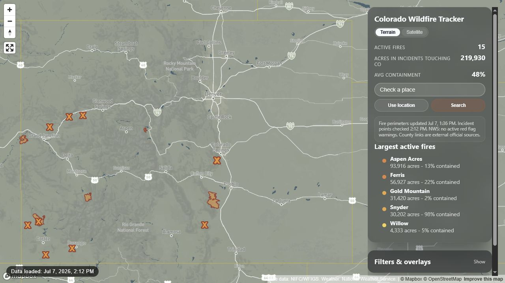

# Colorado Wildfire Tracker

A static, map-first Colorado wildfire tracker based on the original Gazette wildfire map. This version keeps the original dark HUD style and adds safer loading, place search, nearest-fire context, source status, county emergency links, and shareable selected-place URLs.



## Status

This is a lightweight single-page map. It does not require a backend, database, user accounts, saved places, or alert delivery.

The map is designed to fail safely: optional overlays and link data can be unavailable without preventing the main wildfire map from loading.

## Features

- Full-screen Mapbox wildfire map with the original dark HUD presentation.
- NIFC/WFIGS current fire perimeters plus incident points when perimeters are unavailable.
- Largest active fires list, active fire metrics, acreage, average containment, size filters, containment filter, discovery timeline, terrain/satellite style toggle, red flag warning toggle, and AQI overlay toggle.
- Defensive loading for empty, unavailable, or partially malformed remote feeds.
- Compact source/freshness labels for fire data, red flag warnings, AQI, and county emergency links.
- Colorado-focused Mapbox place search with autocomplete, clear no-result states, and selected-place marker.
- Nearest fires list for a selected place, with distance labels for perimeter versus incident-point distances.
- Enhanced fire popups with geometry status, source/freshness, selected-place distance, and county emergency links when reviewed.
- Shareable URL state for selected places, selected fires, map view, style, toggles, filters, and timeline. Browser current-location checks stay local and are not included in shared links.

## Data Sources And Limits

- Fire data: NIFC/WFIGS current fire perimeters and incident locations.
- Red flag warnings: National Weather Service active alerts and affected fire-weather zone geometry.
- AQI overlay: AQICN EPA AQI tile layer from the original map.
- Search and basemaps: Mapbox.
- County emergency links: reviewed static records in `data/county-evacuation-sources.json`.

Evacuation zones are not drawn in this map. County emergency links are external official sources only. Distance to fires is inferred from mapped perimeters or incident points and is not an official risk score.

The map does not provide alerts, saved places, smoke forecast polygons, road closures, evacuation-order polygons, or true change history.

## Run Locally

Serve the folder over local HTTP:

```powershell
py -3 -m http.server 4174 --bind 127.0.0.1
```

Open:

```text
http://127.0.0.1:4174/
```

Use local HTTP for testing. Opening `index.html` directly from the folder may trigger different browser security behavior than the deployed site.

## Deploy With GitHub Pages

Create a fork or new repository, then upload these files and folders:

- `index.html`
- `README.md`
- `.gitattributes`
- `.nojekyll`
- `assets/`
- `data/`
- `docs/`

In GitHub, open the repository settings, choose **Pages**, set the source to the main branch, and deploy from the repository root.

Before publishing publicly, restrict the Mapbox public token to the deployed domain in the Mapbox dashboard. For production use, also replace or validate the AQI tile token/source.

## Project Structure

```text
.
|-- .gitattributes
|-- .nojekyll
|-- index.html
|-- README.md
|-- assets/
|   |-- app.js
|   `-- styles.css
|-- data/
|   `-- county-evacuation-sources.json
`-- docs/
    `-- screenshot.png
```

## Attribution

Based on the Colorado wildfire map fork at [ChrisBrubaker-Gazette/colorado-wildfire-map](https://github.com/ChrisBrubaker-Gazette/colorado-wildfire-map), which traces back to [gazette-evn/colorado-wildfire-map](https://github.com/gazette-evn/colorado-wildfire-map).

## License

No license file is included here because upstream reuse permissions should be confirmed before choosing a public license for this derivative project.
